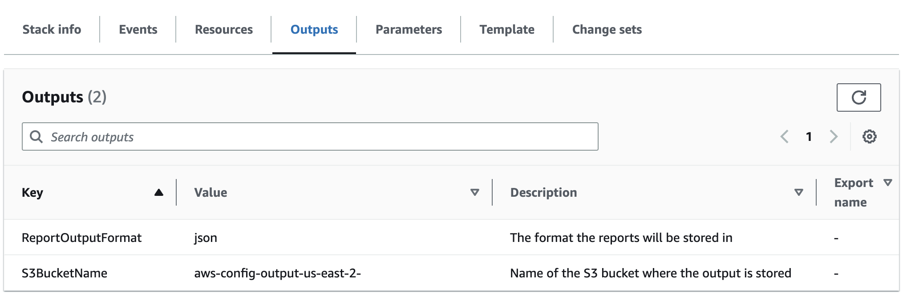

# Overview

This CDK application will create an AWS Lambda function that will query AWS Config and store the results in an S3 bucket. It uses [AWS Config advanced query](https://docs.aws.amazon.com/config/latest/developerguide/querying-AWS-resources.html) to get the results and will store them in either CSV or JSON format. The files can then be downloaded from S3 for further modification or analysis..

## Prerequisites

The following is required:

* AWS Config enabled
* Python > 3.7 (Python 3.9 recommended)
* [AWS CDK](https://aws.amazon.com/cdk/) (this solution was built using v2.67.0)

Assuming you're using AWS CloudShell:

```bash
# Clone this repository
git clone https://github.com/nragusa/awsconfig-to-s3.git
cd awsconfig-to-s3
```

Next, install `pipenv`, a python package dependency manager, along with the dependencies. Finally, activate the environment:

```bash
# Install pipenv
pip3 install --user pipenv
# Install the python packages
pipenv install
# Activate the environment
pipenv shell
```

Next, install the latest v2 version of the [AWS CDK](https://aws.amazon.com/cdk/):

```bash
sudo npm install -g aws-cdk
```

Next, you'll need to edit [cdk.context.json](cdk.context.json) and replace the values of `aggregator_name` and `aggregator_id`
with values from your environment. The `aggregator_name` is the name of an [AWS Config aggregator](https://docs.aws.amazon.com/config/latest/developerguide/aggregate-data.html)
which can be configured to query resources across multiple regions and multiple accounts. You can find the `aggregator_name`
and `aggregator_id` by running the following command:

```bash
aws configservice describe-configuration-aggregators   
{
    "ConfigurationAggregators": [
        {
            "ConfigurationAggregatorName": "aws-controltower-ConfigAggregatorForOrganizations",
            "ConfigurationAggregatorArn": "arn:aws:config:us-east-1:12345678910:config-aggregator/config-aggregator-abcd1234",
            "OrganizationAggregationSource": {
                "RoleArn": "arn:aws:iam::12345678910:role/service-role/AWSControlTowerConfigAggregatorRoleForOrganizations",
                "AllAwsRegions": true
            },
            "CreationTime": "2021-03-12T15:07:06.200000+00:00",
            "LastUpdatedTime": "2021-03-12T15:07:06.381000+00:00"
        }
    ]
    ...
}
```

The `aggregator_id` is the final string of the `ConfigurationAggregatorArn`. In the example above, the `aggregator_id` is `config-aggregator-abcd1234`.

## Set SQL Expression

Edit the file [config_sql_expression.sql](functions/config_sql_expression.sql) and add your SQL expression. Here are some [example queries](https://docs.aws.amazon.com/config/latest/developerguide/example-query.html) you can try. Only specify a single query in this file.

## Deployment

Use the [AWS CDK](https://aws.amazon.com/cdk/) to deploy the code. If not already done, you'll need to bootstrap your environment, being sure to replace `ACCOUNT-NUMBER` and `REGION`.

```bash
cdk bootstrap aws://ACCOUNT-NUMBER/REGION
cdk deploy
```

## Operations

The Lambda function is scheduled to run daily. The reports will be stored in an S3 bucket. The name of the bucket used is found in the `Outputs` tab in the CloudFormation console.


